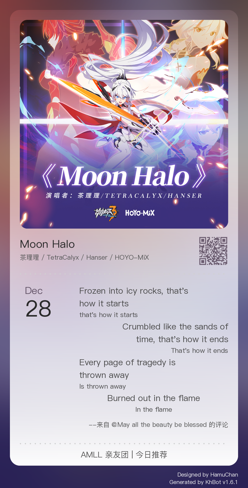

# music-rec-card

一个简单的仿网易云音乐风格的每日推荐音乐卡片生成器，基于 PIL 实现。

## 使用

### 参数优先级

程序会按照以下优先级获取数据：
1. **每日推荐 API** (仅在 daily 模式下)
2. **命令行 `--music-id` 参数**
3. **命令行 `--info` 参数**

### 制卡模式

- **daily**: 每日推荐模式，自动获取指定日期的推荐歌曲和推荐语
- **card**: 普通卡片模式，需手动提供歌曲信息或音乐 ID
- **lyric**: 歌词模式，自动获取歌曲歌词作为引言内容

### 命令行参数

```
usage: music_card_gen.py [-h] [--platform {ncm,qq}]
                         [--mode {daily,card,lyric}] [--date DATE]
                         [--info TITLE ARTIST COVER_URL]
                         [--quote CONTENT SOURCE] [--inner-blurred] [--qrcode]
                         [--qq-music-cookie QQ_MUSIC_COOKIE]
                         [--music-id MUSIC_ID]

生成仿网易云音乐风格的音乐卡片

options:
  -h, --help            show this help message and exit
  --platform {ncm,qq}   获取歌曲的平台 ncm/qq (默认: ncm)
  --mode {daily,card,lyric}
                        制卡模式 (默认: daily)
  --date DATE           日期 YYYY-MM-DD (默认: 当前日期)
  --info TITLE ARTIST COVER_URL
                        手动指定歌曲信息
  --quote CONTENT SOURCE
                        引言内容与来源
  --inner-blurred       卡片内部背景模糊 (默认: 关闭)
  --qrcode              生成二维码 (默认: 关闭)
  --qq-music-cookie QQ_MUSIC_COOKIE
                        QQ 音乐 Cookie
  --music-id MUSIC_ID   歌曲 ID
```

在其他 Python 脚本中调用（确保 `music_card_gen.py` 在同目录）：

```python
import asyncio
from music_card_gen import generate_music_card_process

async def my_script():
    # 调用生成函数，获取 Image 对象
    img = await generate_music_card_process(
        date_str="2025-12-19",
        inner_blurred=True,
        show_qrcode=True
    )
    
    if img:
        # 可以直接处理 img 对象，例如发送到 Discord
        img.save("result_from_external.png")
        print("Got image!")
    else:
        print("Failed to generate.")

if __name__ == "__main__":
    asyncio.run(my_script())
```

## 引言特殊语法

引言支持使用 `[]` 配合 `:-_` 三种字符进行对齐和格式控制：

- **对齐方式**：
  - `[:-:]`：居中对齐
  - `[:-]`：左对齐
  - `[-:]`：右对齐

- **字体大小**：
  - 在标记中使用 `_` 替换 `-` 可以使该行文字缩小（使用 80% 原始字体大小），适用于背景行、翻译或音译行
  - 例如：`[:_:]`（居中对齐 + 小字体）、`[:_]`（左对齐 + 小字体）

- **布局特点**：
  - 指定了对齐方式的行，文字绘制区域为行宽的 80%
  - 未指定对齐方式的普通行，文字绘制区域为行宽的 100%

### 示例

```plaintext
--platform ncm --mode daily --date 2025-12-28 --quote "[:-]Frozen into icy rocks, that's how it starts\n[:_]that's how it starts\n[-:]Crumbled like the sands of time, that's how it ends\n[_:]That's how it ends\n[:-]Every page of tragedy is thrown away\n[:_]Is thrown away\n[:-:]Burned out in the flame\n[:_:]In the flame" "May all the beauty be blessed" --inner-blurred --qrcode --music-id 1859652717
```



## 致谢

本项目使用了 [Google Gemini](https://aistudio.google.com/app/prompts/new_chat?model=gemini-3-pro-preview) 辅助开发。

## 许可

本项目基于 [MIT License](LICENSE) 获得许可。